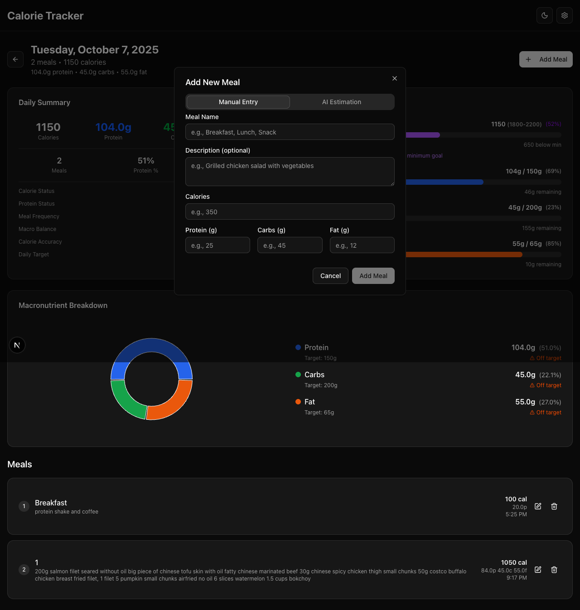

# 🍎 Calorie Tracker

A modern, full-stack calorie tracking application built with Next.js and Express.js, featuring AI-powered calorie estimation and comprehensive nutrition tracking.


## ✨ Features

### 📅 Calendar-Based Tracking
- **Monthly Calendar View**: Visual overview of daily calorie intake with color-coded heatmap
- **Daily Meal Management**: Click any date to view and manage meals for that day
- **Nutrition Trends**: Track calorie and protein trends over time with interactive charts
- **Quick Statistics**: Average calories, macronutrients, and meal counts

### 🍽️ Meal Management
- **Multiple Meals Per Day**: Add unlimited meals with custom naming
- **Dual Input Methods**: 
  - Manual calorie entry
  - AI-powered calorie estimation from food descriptions
- **Macronutrient Tracking**: Protein, carbohydrates, and fat breakdown
- **Meal Editing**: Update or delete existing meals

### 🤖 AI Integration
- **OpenAI-Compatible API**: Support for GPT-3.5, GPT-4, and GPT-4 Turbo models
- **Confidence Scoring**: High/medium/low confidence levels for AI estimates
- **Reasoning Explanations**: AI provides reasoning for calorie estimates
- **User API Key Management**: Secure API key storage and configuration

### 🎨 Modern UI/UX
- **shadcn/ui Components**: Beautiful, accessible component library
- **Dark/Light Theme**: System preference detection with manual toggle
- **Responsive Design**: Optimized for desktop and mobile devices
- **Interactive Charts**: Recharts-powered data visualization


## 🛠️ Tech Stack

### Frontend
- **Next.js 15** - React framework with App Router
- **TypeScript** - Type-safe development
- **Tailwind CSS 4** - Utility-first CSS framework
- **shadcn/ui** - Accessible component library
- **React Hook Form** - Form state management
- **Zod** - Schema validation
- **date-fns** - Date manipulation
- **Recharts** - Data visualization
- **Lucide React** - Icon library

### Backend
- **Express.js 5** - Web application framework
- **TypeScript** - Type-safe backend development
- **SQLite** - Lightweight database
- **CORS** - Cross-origin resource sharing
- **Axios** - HTTP client for API calls

### Development & Testing
- **Jest** - Testing framework
- **React Testing Library** - Component testing
- **Supertest** - API testing
- **ESLint** - Code linting
- **Nodemon** - Development server

### AI & External Services
- **OpenAI-Compatible API** - AI calorie estimation
- **proxy.fuelix.ai** - API proxy service



## 🚀 Getting Started

### Prerequisites
- Node.js 18+ 
- npm or yarn

### Installation

1. **Clone the repository**
   ```bash
   git clone <repository-url>
   cd calorie-tracker
   ```

2. **Install dependencies**
   ```bash
   # Install frontend dependencies
   npm install
   
   # Install backend dependencies
   cd backend
   npm install
   cd ..
   ```

3. **Start the application**
   ```bash
   # Start both frontend and backend servers
   npm run dev:all
   
   # Or start individually:
   # Frontend (port 3001)
   npm run dev
   
   # Backend (port 3002)
   cd backend && npm run dev
   ```

4. **Access the application**
   - Frontend: http://localhost:3001
   - Backend API: http://localhost:3002

## 📊 Database Schema

```sql
CREATE TABLE meals (
  id INTEGER PRIMARY KEY AUTOINCREMENT,
  date TEXT NOT NULL,              -- YYYY-MM-DD format
  name TEXT NOT NULL,              -- Meal name (renameable)
  description TEXT,                -- Optional food description
  calories INTEGER NOT NULL,       -- Calorie count
  protein INTEGER,                 -- Protein in grams
  carbs INTEGER,                   -- Carbohydrates in grams
  fat INTEGER,                     -- Fat in grams
  created_at DATETIME DEFAULT CURRENT_TIMESTAMP,
  updated_at DATETIME DEFAULT CURRENT_TIMESTAMP
);
```

## 🧪 Testing

### Frontend Tests
```bash
# Run all frontend tests
npm test

# Run tests in watch mode
npm run test:watch

# Run tests with coverage
npm run test:coverage

# Run component tests only
npm run test:components
```

### Backend Tests
```bash
# Run all backend tests
cd backend && npm test

# Run unit tests
cd backend && npm run test:unit

# Run integration tests
cd backend && npm run test:integration

# Run tests with coverage
cd backend && npm run test:coverage
```

### Test Coverage
- **Frontend**: Component testing with React Testing Library
- **Backend**: Unit and integration tests with Jest and Supertest
- **API Testing**: Comprehensive endpoint testing
- **Mocking**: External API mocking for reliable tests

## 🔧 API Endpoints

### Meals API
- `GET /api/meals/:date` - Get meals for a specific date
- `GET /api/meals/totals/:startDate/:endDate` - Get daily totals for date range
- `POST /api/meals` - Add new meal
- `PUT /api/meals/:id` - Update existing meal
- `DELETE /api/meals/:id` - Delete meal

### LLM API
- `POST /api/llm/estimate-calories` - AI calorie estimation
- `GET /api/llm/models` - Available model list

## 🎯 Key Features Implementation

### Calendar Interface
- Monthly view with clickable dates
- Daily calorie totals displayed
- Navigation between months
- Quick stats overview
- Color-coded heatmap for calorie ranges

### Multiple Meal Management
- Add unlimited meals per day
- Rename meals to user preference
- Edit existing meals
- Delete meals with confirmation

### Dual Input Methods
- **Manual**: Direct calorie and macronutrient input
- **AI-Powered**: Food description → calorie estimation with confidence levels

### LLM Integration
- OpenAI-compatible API support
- Multiple model options (GPT-3.5, GPT-4, GPT-4 Turbo)
- User-provided API key management
- Confidence levels and reasoning explanations

## 🏗️ Architecture

### Project Structure
```
calorie-tracker/
├── src/                          # Next.js frontend
│   ├── app/                      # App Router pages
│   ├── components/               # React components
│   │   ├── charts/              # Data visualization components
│   │   ├── ui/                  # shadcn/ui components
│   │   ├── CalendarView.tsx     # Monthly calendar interface
│   │   ├── DayView.tsx          # Daily meal management
│   │   ├── MealDialog.tsx       # Add/edit meal dialog
│   │   └── SettingsDialog.tsx   # Configuration dialog
│   └── lib/                     # Utility functions
├── backend/                      # Express.js API server
│   ├── src/
│   │   ├── server.ts           # Main server file
│   │   ├── database.ts         # SQLite operations
│   │   └── routes/             # API route handlers
│   └── tests/                  # Backend tests
└── screenshots/                 # Application screenshots
```

### Design Patterns
- **Component-Based Architecture**: Reusable React components
- **RESTful API Design**: Clean, predictable API endpoints
- **Type Safety**: Full TypeScript implementation
- **Error Handling**: Comprehensive error management
- **Responsive Design**: Mobile-first approach

## 🔒 Security Features

- **API Key Management**: Secure storage in localStorage
- **Input Validation**: Zod schema validation
- **CORS Configuration**: Proper cross-origin setup
- **Error Handling**: Graceful error management
- **Type Safety**: TypeScript prevents runtime errors

## 📈 Performance Optimizations

- **Next.js 15**: Latest framework with Turbopack
- **Code Splitting**: Automatic bundle optimization
- **Image Optimization**: Next.js built-in image optimization
- **Database Indexing**: Efficient SQLite queries
- **Caching**: Strategic data caching

## 🚀 Deployment

### Development
```bash
# Start development servers
npm run dev:all
```

### Production Build
```bash
# Build frontend
npm run build

# Build backend
cd backend && npm run build
```

### Environment Variables
```bash
# Backend .env
PORT=3002
NODE_ENV=production
```

## 🔮 Future Enhancements

### Planned Features
- **User Authentication**: Multi-user support
- **Nutrition Goals**: Customizable daily targets
- **Data Export**: CSV/JSON export functionality
- **Meal Photos**: Image recognition for calorie estimation
- **Recipe Database**: Integrated recipe management
- **Social Features**: Share progress with friends

### Technical Improvements
- **Database Migrations**: Version-controlled schema changes
- **API Caching**: Redis-based caching layer
- **Real-time Updates**: WebSocket integration
- **Progressive Web App**: PWA features
- **Offline Support**: Service worker implementation
- **Data Synchronization**: Cloud backup and sync

## 📝 License

This project is licensed under the MIT License - see the LICENSE file for details.

## 🤝 Contributing

1. Fork the repository
2. Create a feature branch (`git checkout -b feature/amazing-feature`)
3. Commit your changes (`git commit -m 'Add some amazing feature'`)
4. Push to the branch (`git push origin feature/amazing-feature`)
5. Open a Pull Request

## 📞 Contact

For questions or support, please open an issue on GitHub.

---

**Built with ❤️ using Next.js, Express.js, and modern web technologies**